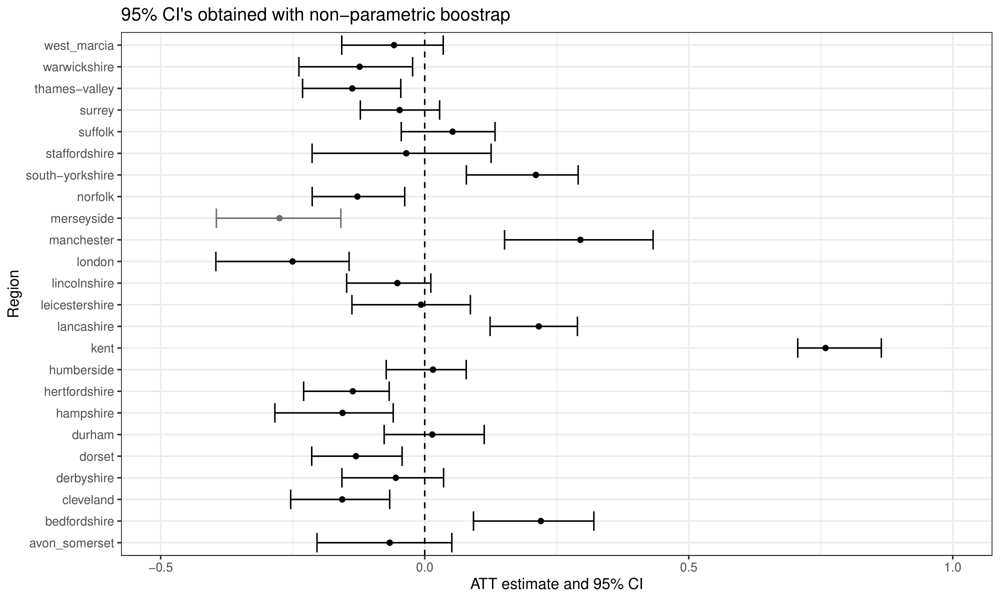

I contest findings that Mo Salah signing with Liverpool F.C. reduced the number
of hate crimes in the area and decreased Islamophobia among Liverpool F.C.
Twitter followers.

<!--more-->

<script type="text/javascript" id="MathJax-script" async
  src="https://cdn.jsdelivr.net/npm/mathjax@3/es5/tex-mml-chtml.js">
</script>

```{r, echo=F, include=F}
library(tidyverse)
knitr::opts_chunk$set(fig.path = "static")

old_data <- read_csv("islamophobic_hc_2.csv")  %>%
    mutate(
           date = as.Date(paste0(year, "/", month_start, "/01")),
           n_months = as.numeric(month_end) - as.numeric(month_start),
           )  %>%
    mutate(n = n/n_months) %>%
    select(date, n) %>%
    mutate(source = "WDTK? FOI request")

my_data <- read_csv("merseyside_islamophobic_hate_crimes.csv") %>%
    pivot_longer(
                 contains("Month"),
                 names_prefix = "Month_",
                 names_to = "month",
                 values_to = "n"
                 )  %>%
    mutate(date = as.Date(paste0(Year, "/", month, "/01"))) %>%
    filter(Year > 2016) %>%
    drop_na() %>%
    select(date, n) %>%
    mutate(source = "My FOIA") %>%
    filter(row_number() > 2)

my_data <- my_data %>%
    mutate(gnum = floor((row_number()+2)/3))  %>%
    mutate(gnum = ifelse(row_number() %in% c(4,5),-1,gnum))  %>%
    group_by(gnum) %>%
    summarize(n = mean(n), date = date[1]) %>%
    mutate(source = "My FOI request")
```

Published in the APSR in 2021, "Can Exposure to Celebrities Reduce Prejudice?
The Effect of Mohamed Salah on Islamophobic Behaviors and Attitudes" linked
the move of Mo Salah —a famous Muslim football player— to play for Liverpool
F.C. with a reduction in the rate of hate crimes in the area and decrease in
the number Islamophobic of tweets among Liverpool fans. The article was widely
shared, and received major international coverage by [The Economist](https://www.economist.com/britain/2019/06/06/mo-salahs-goals-help-to-tackle-islamophobia-in-liverpool?linkId=100000006633012),
[The Independent](https://www.independent.co.uk/sport/football/news/mohamed-salah-liverpool-islamophobia-muslim-goal-celebration-study-a8943501.html),
[Vice](https://www.vice.com/en/article/qv7ev7/mo-salah-has-singlehandedly-reduced-islamophobia-in-liverpool),
and [Al Jazeera](https://www.aljazeera.net/news/humanrights/2019/6/3/%D8%AF%D8%B1%D8%A7%D8%B3%D8%A9-%D8%A8%D8%B1%D9%8A%D8%B7%D8%A7%D9%86%D9%8A%D8%A9-%D8%B5%D9%84%D8%A7%D8%AD-%D9%87%D8%B2%D9%85),
among other outlets, it was discussed on the venerable
[Freakonomics](https://freakonomics.com/podcast/can-britain-get-its-great-back-ep-393/),
and was also highlighted as the [cover article](https://politicalsciencenow.com/can-exposure-to-celebrities-reduce-prejudice-the-effect-of-mohamed-salah-on-islamophobic-behaviors-and-attitudes/)
for the APSR issue which it was published. The underlying theory is that
exposure to Mo Salah (a prominent Muslim role model) caused Liverpool Fans and
people Liverpool area to more tolerant towards Muslims in the area and online.

In what follows, I will discuss my thoughts on the paper. I think that the
synthetic control analyses presented in the study do not suggest that Mo Salah
reduced hate crimes or Islamophobic tweets among Liverpool fans. I have four
main points of contention:

1. Islamophobic hate crimes make up only 4% of U.K. hate crimes; a 16%
   reduction in hate crimes move is an implausibly large effect. I also do not
   believe that Salah could have halved the number of Islamophobic tweets
   written by Liverpool fans.
2. Data from a freedom of information request I filed suggests that
   Islamophobic hate crimes remained relatively constant around the date of Mo
   Salah's move.
3. One of the inference strategies the authors use — the non-parametric
   bootstrap — is inappropriate when there is just one treated unit. If an
   alternative method to construct the standard errors is used, the effect is
   no longer significant.
4. I think that the results from the permutation inference performed by the
   authors are overstated: they actually suggest that the change in hate crimes
   and Islamophobic tweets in Merseyside —the county Liverpool sits in— was not
   anomalous relative to other counties.

## The Effect Is Implausibly Large

I don't believe that a celebrity can decrease the rate of hate crimes in an
area by anything close to 16%. This is especially true for celebrity
hypothesized to decrease the amount of *Islamophobic* hate crimes, which make
up just 4% of U.K. hate crimes. Clearly, it should not be possible for a
mechanism that reduces anti-Muslim hate crimes to reduce overall hate crimes by
16%, as eliminating all anti-Muslim hate crimes would only reduce hate crimes
by 4%.

I think that this issue might have initially flown under the radar, as the
paper originally stated that Anti-Muslim hate crimes make up 39% of U.K. hate
crimes. I wrote to the authors who quickly issued a
[correction](https://www.cambridge.org/core/journals/american-political-science-review/article/can-exposure-to-celebrities-reduce-prejudice-the-effect-of-mohamed-salah-on-islamophobic-behaviors-and-attitudes-corrigendum/8F1860991B7B735120035B24DF17352F) which explains the source of the issue. Yet I am not sure that the
ramifications of this correction have been completely appreciated! A 16%
decrease cannot possibly be attributed to a reduction in Islamophobic hate
crimes. This fact alone should show that the result is either spurious (driven by chance or some confounding
factor), or that Mo Salah reduces hate crimes that were not reported as Islamophobic.

## Islamophobic Hate Crimes Did not Decrease In Merseyside Around Salah's Signing

This dovetails nicely into my second point: I managed to obtain data on the
rate of Islamophobic hate crimes over time in Merseyside, which does not change
around Salah's signing.

To obtain this data, I sent a freedom of information request with the
Merseyside Police Department, supplied me with data on Islamophobic
hate crimes from mid-2017 onwards. They couldn't supply me with earlier data
as it was not kept after an update to the recording scheme, [but I was able to
find this data in a previous freedom of information request on the public
records site What to They Know](https://www.whatdotheyknow.com/request/daily_rates_of_islamaphobic_hate_16)?

```{r, echo=F}
bind_rows(my_data, old_data)  %>%
    ggplot(aes(x=date, y = n, col = source)) +
    geom_step() +
    geom_point() +
    geom_vline(xintercept = as.Date("2017/06/01"), linetype = 2) +
    labs(col = "Data source") +
    scale_y_continuous(limits = c(0,25)) +
    ylab("Number of Reported Hate Crimes in Merseyside") +
    xlab("Date") +
    ggtitle("Islamophobic Hate Crimes Before and After Mo Salah's Signing")  +
    theme_bw() +
    annotate("text", x = as.Date("2019-02-28") , y=22, label = "Mo Salah Moves to Liverpool")

```

There are a lot of difficulties with this analysis: the two datasets don't line
up perfectly, and I can't rule out the possibility that the rate of
Islamophobic hate crime would have spiked if Mo Salah had not signed. However,
it is clear that Islamophobic hate crime did not disappear after the signing of
Salah. I think the most reasonable conclusion to reach is that Salah simply had
no effect on the number of hate crimes in the area.

# The Non-Parametric Bootstrap has Poor Coverage in This Setting

If Mo Salah did not have an effect on the number of Islamophobic Hate Crimes,
then what explains the significant effect found by the authors? I argue that
the p-values calculated by the authors drastically understate the likelihood
that these results are due to random chance, and the estimates they obtain are
actually perfectly consistent with the random fluctuations one would expect
under no effect.

As part of their inference strategy, the authors use the non-parametric
bootstrap methods packaged with the `gsynth` package to calculate p-values
associated with the estimated effect of Salah's move on the number of hate
crimes in the area and Islamophobic tweets. Both the [package
documentation](https://yiqingxu.org/packages/gsynth/articles/tutorial.html) and
the article introducing the package stress that this method is inappropriate
when the number of treated units is under 40 [@gsynth p 8]. When there is just
one treated unit (as there is here) the non-parametric bootstrap has drastic
under-coverage, and identifies statistically significant changes when applied
to 70% control counties, as can be seen below:

```{r, echo=F}

```

To get an intuitive sense of what the problem here is, ignore the panel
structure of the data, and pretend that you want to derive the variance for a
difference of two group means, $\hat{Y_1}$, and $\hat{Y_0}$. As a reminder, the
variance a difference between two groups is the sum of the variance of the
two within-group estimators:

$$Var(\hat{Y_1} - \hat{Y_0}) = Var(\hat{Y_1}) + Var(\hat{Y_0})$$

Now consider what happens when we try and approximate this calculation with the
bootstrap. Each bootstrap sample must contain the only treated unit, and
because of this, the bootstrapped variance of the treatment group is zero. The
confidence intervals and p-values then fail to reflect uncertainty about the
mean of the treatment group, and under-cover. An analogous principle underlies
the poor coverage we see here - the small number of treated units means that
the bootstrap distribution cannot approximate the sampling distribution of the
estimator, and we see drastic under-coverage.

The significant result from the non-parametric bootstrap cannot be taken to show
that the effect cannot be due to chance, as the procedure will identify
spurious effects in 70% of cases when there is actually no effect.

# Other Methods of Inference Used in The Paper

So far, I have discussed the sampling-based inference presented in the paper to
suggest that the observed decrease in hate crimes and tweets cannot be
explained by chance. A reader might still be convinced by one of the other
complimentary forms of inference presented by the authors based on placebo
tests, which compare the observed treatment effect to a distribution of placebo
effects obtained by pretending every control unit was treated. In this section,
I would like to highlight reasons to think that the placebo tests presented
also overstate the evidence that suggests Salah had an effect.

I hope I am not splitting hairs here, but it appears the two-sided p-value
(.08) obtained from permutation inference using the hate crime data is only
significant (because of the specific seed chosen to start the synthetic control
algorithm. If another seed is chosen, the result is usually 3/24, or 0.125.
Sometimes, it is even as low as 4/24. At any rate, I think the exact number is
unimportant; one can look at distribution of point estimates in the figure
above and see that the observed change is not extreme relative to the
distribution of placebo effects.

I also think the framing of the permutation-inference results presented by the
authors overstate how anomalous the treatment effect estimate is relative to
the estimates in the control counties:

>   We employ the same permutation inference approach as in the hate crime
>   analysis. Only for Liverpool F.C. followers do we estimate a consistently
>   negative treatment effect in the posttreatment period. The placebo
>   estimates tend to oscillate between positive and negative treatment
>   effects, while the Liverpool treatment effect estimates are negative in
>   every posttreatment month but one—again suggesting that the observed
>   estimate for Liverpool F.C. followers is unlikely to have occurred by
>   chance. [@salah p 9]

It is true that Liverpool F.C. saw the largest decrease in Anti-Muslim hate
crimes of the five clubs analyzed. What is left unsaid is that another football
club, Chelsea F.C., saw a *30% larger* estimated positive effect, which
suggests that the effect among Liverpool fans was not unusual relative from the
change observed among other club fanbases. The comment that Liverpool's effect
estimate is the only one that is significantly negative also strikes me as
hypothesizing after the results are known - if Liverpool's effect were only
negative after a burn-in period, or negative only during the football season, I
believe that this could have been taken as evidence too.

## Final Thoughts

There's more to the article than the points that I have raised, and I encourage
everyone to read it.  I was also only able to write this piece because of the
superlative care the authors took in preparing their replication materials,
which allowed me to more fully engage with and understand the paper. My
personal view is that I am convinced from the survey experiment the authors
performed that Mo Salah's presence on the field (when appropriately framed)
makes people less likely to endorse Islamophobic beliefs, but I do not believe
this extends to real-life behavior.

# References
