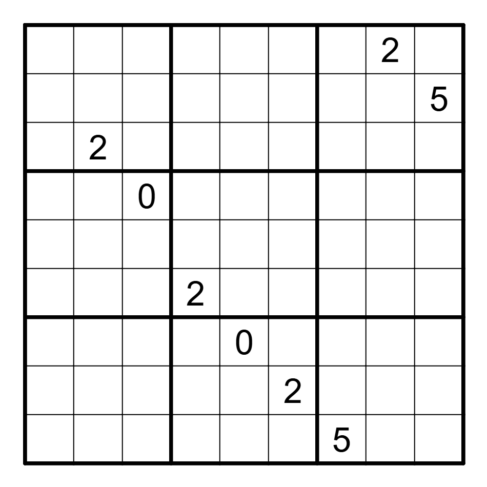

Jane Street is a quantitative trading firm that puts out monthly puzzles. Last
month, I took a stab at their monthly puzzle, and share my solution in this post.

<!--more-->

Jane Street is a quantitative trading firm that puts out monthly puzzles that
normally focus on probability, programming or statistics. Last month, I tried
solving one of their puzzles for the first time, and really enjoyed the
process. Here's how I attacked the [somewhat square Sudoku
Puzzle](https://www.janestreet.com/puzzles/somewhat-square-sudoku-index/).

## The Puzzle:

We were given us the following Sudoku board, and asked to find the unique board
that maximized the [greatest common
divisor](https://en.wikipedia.org/wiki/Greatest_common_divisor) of the numbers
spelled out by the rows. As an added twist, we were allowed to pick 9 of the 10
digits \{0-9\} to use to fill out the grid, which had to obey normal Sudoku
rules.

In this post, I discuss my coding-based approach to solve the puzzle, which is
a little different from the [number-theory approach they posted on their solutions
page.](https://www.janestreet.com/puzzles/somewhat-square-sudoku-solution/). If
you are in a hurry, the TL;DR is that the valid solution space too slow to use
brute-force on, but a branch-and-bound strategy works wonders in cutting down
the amount of work you have to do so that the puzzle is solvable.

## First Approach: Backtracking

The canonical computer-science way to solve a puzzle like this is via a
backtracking algorithm, [so much so that the wikipedia article for backtracking
features a tutorial on how to use the algorithm to solve
sudoku](https://en.wikipedia.org/wiki/Backtracking).

Briefly put, the backtracking algorithm to solve a single Sudoku board works as
follows, and is extremely easy to implement.

> # Backtracking Algorithm:
>
> 1. Iterate over spaces in the board until you find an empty space. Terminate if the board is filled.
> 2. Place a number 0 in this space
> 3. If this invalidates the board, try the next number. Otherwise go to step 1.

The only minor complications in our setting is that there will not be one
unique solution so we will have to find all solutions and then report the one
with the greatest GCD, but this is no issue. I quickly implemented this in
Rust, and then waited for my computer to finish searching.

## Backtracking is too slow:

Within a minute, it became clear that this solution was never going to work;
the space of valid solutions is just too large to exhaustively iterate over
given the limited number of tiles they give us to get started.

This failure shouldn't be too surprising given that these puzzles have a
reputation of being difficult to solve ([sometimes](https://www.janestreet.com/puzzles/turn-based-strategy-game-solution/), [insanely](https://www.janestreet.com/puzzles/the-wright-stuff-solution/)
[so](https://www.janestreet.com/puzzles/games-night-solution/)), so it would be
odd if the most obvious solution worked.

## Second Approach: Branch-and-Bound

So, where can we go from here? Listing every solution would take too much time,
so maybe we should consider that we are really trying to solve an optimization
problem (find the board with the greatest GCD) and see if this generates any
insights.

From this perspective, we can see that when we are iterating over possible
solutions, something like 99.99% of them will be pretty terrible and have a no
chance of having a large GCD. For example, if just two of the rows are prime,
if two of the rows are prime, then the GCD for the whole board must be one.

There must be some way that we can either prune or de-prioritize searching
these boards so we can focus on promising nodes. And we can! Using a variant of
the backtracking algorithm called
[branch-and-bound](https://en.wikipedia.org/wiki/Branch_and_bound), we can use
any valid upper bound on the GCD given a partial board state to drastically
speed up the search:

> # Branch and Bound Algorithm
>
> 1. Iterate over spaces in the board until you find an empty space. Terminate if the board is filled.
> 2. Place a number 0 in this space. If this invalidates the board, replace zero with the next number until you find one that works.
> 3. Calculate an upper bound for the GCD of the board as it has been filled so far. If this is lower than the best board you have found so far, return to step 2 and try the next number. If it is the upper bound is greater than the best board so far, go to step 1.

You could likely use the prime trick I suggested above to speed up the search,
but I used the fact that if we have two sets of numbers and one is a subset of
the other, the GCD of the superset set must be smaller than the GCD of the
subset. Put formally:

$$\mathbb{A} \subset \mathbb{B} \Rightarrow gcd(\mathbb{A}) > gcd(\mathbb{B})$$

Thus, if we see a board that has any filled in rows, the GCD of these rows acts
as an upper bound on the GCD of the board after it has been filled in. Whenever
we fill in a new row in a potential solution, we can check if the board can
have a GCD larger than the best GCD we have seen so far.  If it cannot, we can
skip this board and all other boards that have the same rows, drastically
speeding up our search by over 99%. Importantly, if we fill in the board in
'reading order' (completing the top row first, then the next row and so on), we
complete rows in the fastest order, maximizing our opportunity to prune bad
paths early and thus our time savings.

This solution worked extremely well! I was able to find the solution in just a
few minutes, and most of that was because I did not bother to share the best
board state between different threads that were searching in parallel, leading
to some inefficiencies and a dangling thread. You can find my implementation of
below, but the code is a little messy as I was working quickly.

## Rust Code:

# Final Thoughts:

Overall, I loved this puzzle. I am not sure if I understand the intended
solution, but I really enjoyed the process of programming the backtracking
algorithm and then thinking of ways to speed up the search until I realized I
could use the GCD bound I described to branch-and-bound. I am very interested
to see in the next few days if people solved the puzzle in other ways or using
other, more efficient bounds - please reach out to me if you did!
